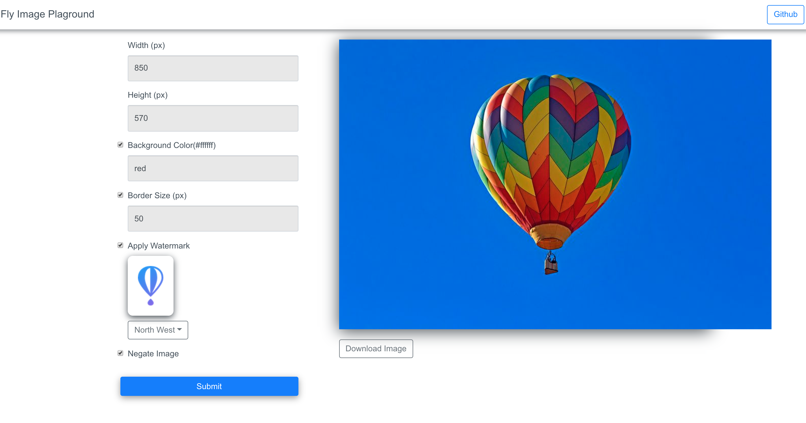

# Fly.io Image Playground
This app allows you to play around with some of fly.io's <a href="https://fly.io/docs/apps/api/classes/fly_image.image.html" target="_blank">Image APIs</a>. This app runs on the superfast fly.io's edge servers. This is not a **node.js** app but a **fly app**. 

The live app is running on fly.io's edge servers here:
https://fly-image-playground.edgeapp.net/


### Before Image


### After Image

Notice that this "after" image has inverted colors, red border and a watermark image near the top left corner!


#### Here is how it works:

1. The front-end is a React app and it simply creates a URL based on various configuration
2. Sets the URL as the `src` for the image that inturn makes a GET request to the Fly's server.
3. The Fly server extracts all the configuration and manipulates the image using fly's image API and returns the manipulated image back

# Installation

## Install fly.io
1. Install <a href="http://nodejs.org/" target="_blank">Node.js</a> 
2. Open Terminal and run `npm install -g @fly/fly`
3. Set `FLY_ACCESS_TOKEN` for the CLI

    3.1 Create a <a href="https://fly.io/app/sign-up" target="_blank"> fly.io account</a>

    3.2 Go to `Accounts | Settings | Access tokens`

    3.3 Click on `Create access token` and enter some useful name like your app's name.

    3.4 Copy the access token
    
    3.5 Set the access token to environment variable `export FLY_ACCESS_TOKEN=<your-token>`
    


## Install the code
This repo has both the fly.io's server and React client (in /client). Below are the steps to install and run both of them.


1. `git clone https://github.com/rajaraodv/fly-image-playground.git`
2. `cd fly-image-playground`
3. `npm install`


# Running locally
After all the installation work, do the following:

1. Run `fly server`
2. Open `localhost:3000`

# Running on fly.io's edge servers
After all the installation work, do the following:

1. Run `fly login` and login from the command line
2. Run `fly apps create <app-name>`. Replace `<app-name>` with some unique name for your app.
3. Update the app name in `.fly.yml` file's `app`
4. Run `fly deploy` to deploy the app
5. Your app should be running at `https://<your-app-name>.edgeapp.net/`


# React client 
**Read this section only if you plan to update the React client.**

The client is inside `/client` folder. If you want to make changes, it's based on `create-react-app`.
To run it locally do the following:

1. `cd fly-image-playground/client`
2. `npm install`
3. `npm start` 
4. The React dev server should start at port `3001`.

Notes:
The `/client/package.json` file of the React app has two changes.

1. It uses port `3001` because fly.io defaults to `3000. `"start": "PORT=3001 react-scripts start",` 

2. It proxys AJAX requests from the React client to port `3000` so it can talk to the server. `"proxy": "http://localhost:3000"`

### Updating React App and deploying it to fly.io
After you are done making changes to the client app, do the following:

1.  Make sure to run `npm run build` to build a production version.

2. Don't forget to update the newer versions of the JS, CSS files in `.fly.yml`. Currently the fly server needs us to manually add all the individual files that are part of the React production app into `.fly.yml`.
3. The following shows the list of files that are being served in the current production app.

```
    ...
    ...
    files:
    - client/build/index.html
    - client/build/static/js/main.ff4d387e.js
    - client/build/static/js/main.ff4d387e.js.map
    - client/build/static/css/main.11c6a295.css
    - client/build/static/css/main.11c6a295.css.map
    - client/build/asset-manifest.json
    - client/build/favicon.ico
    - client/build/manifest.json
    - client/build/service-worker.js
```


# License
MIT
